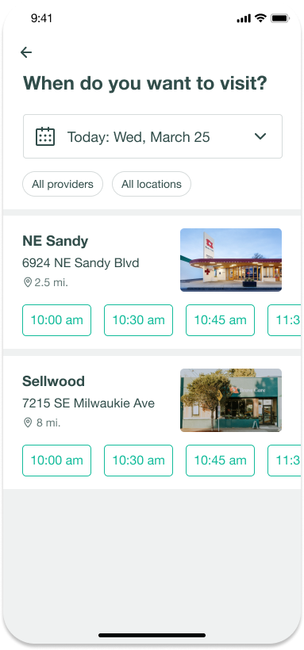

# Getting Started

Getting the frontend up and running:

```bash
cd frontend
yarn install
yarn dev
```

Getting the backend up and running:

```bash
cd backend
yarn install
yarn dev
```

## Tests

Each project has their own Jest unit tests.

```bash
yarn test --watch
```

# The Ask

## For the Frontend folks

The project is set up with basic data fetching and rendering of a list of available appointment slots. We have a design from our design team for what they want the UI to look like. The design is here: [Figma file](https://www.figma.com/file/9sG5XUJdSJmgjBnP6EZgAj/Appointment-Booking?node-id=0%3A1)

1. Fetch available appointment slots from the backend, and display.
2. Given clinics in different timezones, results should be in the relative timezone to the clinic.
3. Allow the user to select a different clinic or day.
4. Allow user to book an appointment.
5. Bonus: handle users who leave the page open then come back to it.



## For the Backend folks

1. Set up an endpoint that will handle creating an appointment
2. Generate a list of available appointment slots per clinic based on successfully created appointments
3. Given clinics in different timezones, results should be in the relative timezone to the clinic.
4. Prevent users from scheduling appointments within 5 minutes of the current time (since they couldn't actually get to the clinic in that time).
5. Bonus: If two users start the booking process for the same timeslot, how do you handle the conflict.

# The time

Give yourself anywhere from 2-4 hours and complete whatever you can in that timeframe. Clone this repo, and put it into your own Github as a new private repo. Invite @kniedermaier when you're ready and we will review with our team and look forward to discussing it with you.
